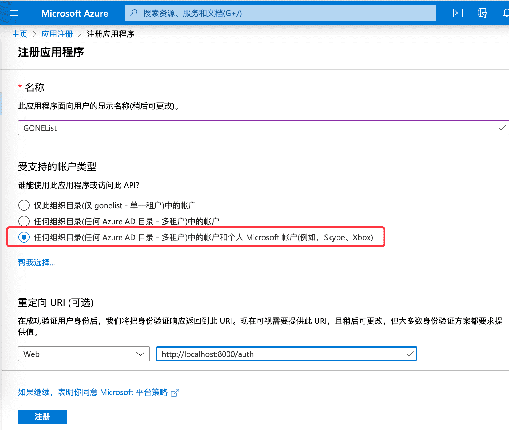
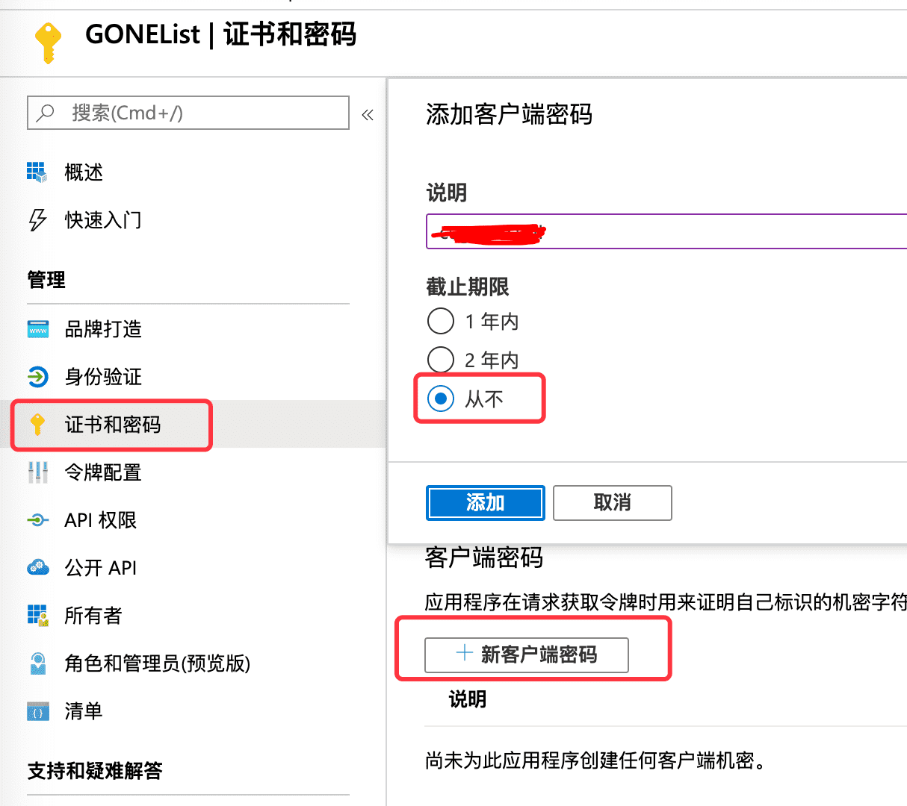
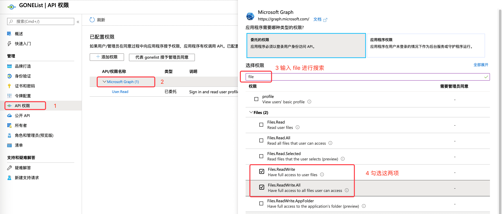
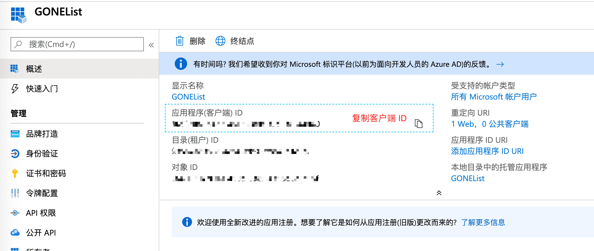
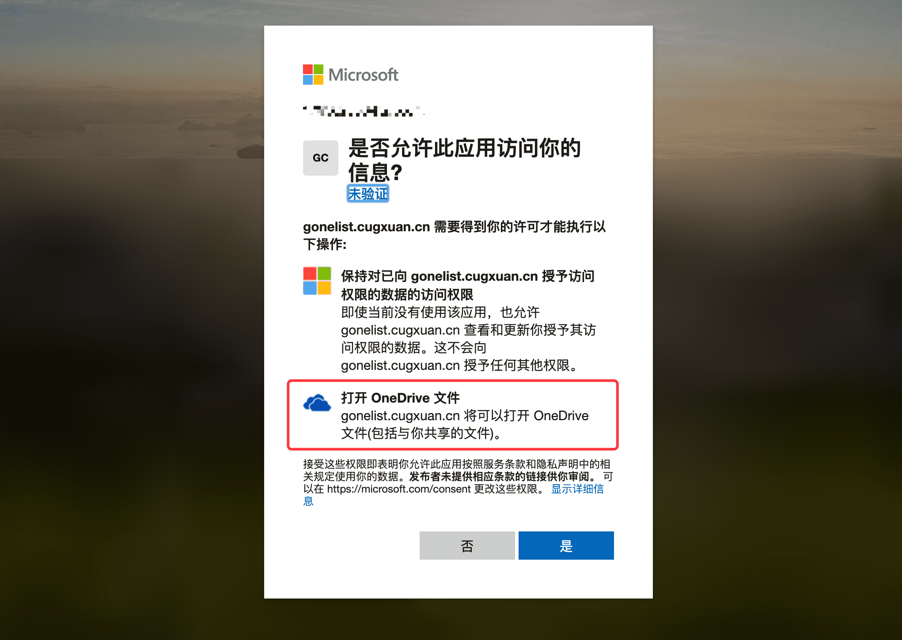

# 使用 GONEList 搭建在线分享网盘

[GONEList](https://github.com/cugxuan/gonelist) 是由 `golang+vue` 编写的基于 onedrive 的在线网盘，有着跨平台等特性，搭建简单。本次搭建使用的是系统是 `64 位 Ubuntu 18.04`，Linux 系统一般都可以兼容对应的操作



- [下载已编译的程序](#下载已编译的程序)
- [创建 MicroSoft 应用](#创建-MicroSoft-应用)
- [修改配置信息](#修改配置信息)
- [启动和终止应用](#启动和终止应用)
- [HTTPS](#HTTPS)



# 下载已编译的程序

在 [Github-Release](https://github.com/cugxuan/gonelist/releases) 或者 [gonelist-release](https://gonelist.cugxuan.cn/#/gonelist-release) 下载您使用平台对应的二进制文件，并且解压进入

```
// 下载 Linux 版
$ wget https://gonelist.cugxuan.cn/d/gonelist-release/gonelist_linux_amd64.tar.gz
// 下载 github release 也可以，但下载最新版
$ wget https://github.com/cugxuan/gonelist/releases/download/v0.2/gonelist_linux_amd64.tar.gz
// 解压进入文件夹
$ tar -zxf gonelist_linux_amd64.tar.gz && cd gonelist_linux_amd64/
```

# 创建 MicroSoft 应用

如果您的 **整个网盘以及微软账号** 里面没有任何隐私资料，可以直接使用我们的默认 `client_id` 和 `client_secret`，直接跳转到 [修改配置信息](#修改配置信息)，否则请申请自己单独的应用来**保护您的隐私安全**。
（注：您可以通过 [你已授予访问权限的应用和服务](https://account.live.com/consent/Manage) 来管理自己许可的应用）

## 注册应用程序

打开 [注册应用程序](https://portal.azure.com/#blade/Microsoft_AAD_RegisteredApps/ApplicationsListBlade) 的链接，登陆后选择「注册应用程序」，输入「名称」，选择「任何组织目录中的账户和个人」，输入重定向 URL 为 `http://localhost:8000/auth`，「注册」即可



## 客户端密码

注册好应用程序之后，选择「证书和密码」，点击「新客户端密码」，输入一串密码，选择时间为「永久」，点击「添加」
（注：在添加之后输入的密码之后会消失，**请记录下来 client_secret 的值**）



## API 权限

选择「API 权限」，点击 「MicroSoft Graph」，在「选择权限」中输入 `file`，勾选 「Files.read」（注：`Files.read` 是只读最小权限，图中权限较大，也同样可以），点击「确定」



## 客户端 id

在 config 中还有一项是客户端 id，在概述中记录下即可，至此我们的 `client_id` 和 `client_secret` 都已经拿到了



# 修改配置信息

在第一步完成之后，进入到了 `gonelist_linux_amd64` 文件夹，在 `config.json` 文件中有许多可以配置的地方，建议填入自己的 `client_id` 以及 `client_secret`，`folder_sub` 可以设置 GONEList 的根目录是从 onedrive 的什么地方开始

```
{
  //------建议填入自己的 id 和 secret --------
  "client_id": "88966400-cb81-49cb-89c2-6d09f0a3d9e2",
  "redirect_url": "http://localhost:8000/auth",
  "client_secret": "/FKad]FPtKNk-=j11aPwEOBSxYUYUU54",
  // 建议设置一个自己喜欢的字符串
  "state": "23333",
  "server": {
    // 监听的端口
    "port": 8000,
    // 自动刷新的时间单位是分钟，默认 10 分钟，不要超过 1 小时
    "refresh_time": 10,
    // 登陆成功后，跳转的 URL，可不设置，新版已自动跳转
    "site_url": "http://localhost:8000",
    // 自定义 onedrive 的子文件夹
    "folder_sub": "/",
    //静态页面的目录，默认当前路径下的dist目录
    "dist_path": "./dist/",
    // 是否绑定到 0.0.0.0
    "bind_global": true
  }
}
```

# 启动和终止应用

现在就可以直接启动应用了

```
// 启动应用
$ ./gonelist_linux_amd64
// 后台运行应用
$ nohup ./gonelist_linux_amd64 >nohup.log 2>&1 &
// 结束后台应用
$ ps -ef | grep go
root     21020 20947  0 20:08 pts/3    00:00:00 ./gonelist_linux_amd64
$ kill 21020
```

浏览器打开 `http://localhost:8000` 即可访问，如果你是部署在服务器，可以使用 `http://yoursite:8000` 访问。打开后会跳转登陆页面，授予权限



如果是在本地部署，登陆成功会跳转到首页，此时已经完成部署。
如果是在服务器部署，登陆成功会跳转到`http://localhost:8000/auth?code=xxx`，将当前网址改成 `http://yoursite:8000/auth?code=xxx` 再回车等待文件加载后，会自动跳转你的网站 `http://yoursite:8000`

# HTTPS

如果你的域名申请了 HTTPS 证书，可以通过 nginx 反向代理。**建议将** `config.json` 中的 `bind_global` 设置为 `false`（作用就是不会让外部通过 http 访问），然后修改 nginx 设置，以我的 `https://gonelist.cugxuan.cn`，腾讯云的免费证书为例

```
$ cd /etc/nginx/sites-enabled
$ vi gonelist.cugxuan.cn
```

在 nginx 配置文件中写入下面内容，然后 `$ nginx` 启动或 `$ nginx -s reload` 重启即可
```
server {
    listen       80;
    server_name  gonelist.cugxuan.cn;

    # 强制跳转 HTTPS
    rewrite ^(.*) https://$server_name$1 permanent;

    error_page   500 502 503 504  /50x.html;
    location = /50x.html {
        root   html;
    }
}

# 监听接口接口
upstream gonelist_pool {
    server 127.0.0.1:8000;
}

server {
    listen 443;

    server_name gonelist.cugxuan.cn; #填写绑定证书的域名
    // 这一部分都是腾讯云的配置说明抄下来改路径
    ssl on;
    ssl_certificate tecent-ssl/gonelist.cugxuan.cn/Nginx/1_gonelist.cugxuan.cn_bundle.crt;
    ssl_certificate_key tecent-ssl/gonelist.cugxuan.cn/Nginx/2_gonelist.cugxuan.cn.key;
    ssl_session_timeout 5m;
    ssl_protocols TLSv1 TLSv1.1 TLSv1.2; #按照这个协议配置
    ssl_ciphers ECDHE-RSA-AES128-GCM-SHA256:HIGH:!aNULL:!MD5:!RC4:!DHE;#按照这个套件配置
    ssl_prefer_server_ciphers on;

    location / {
        proxy_set_header Host $host;
        proxy_set_header X-Forwarded-For $proxy_add_x_forwarded_for;
        proxy_pass http://gonelist_pool;
    }
}
```